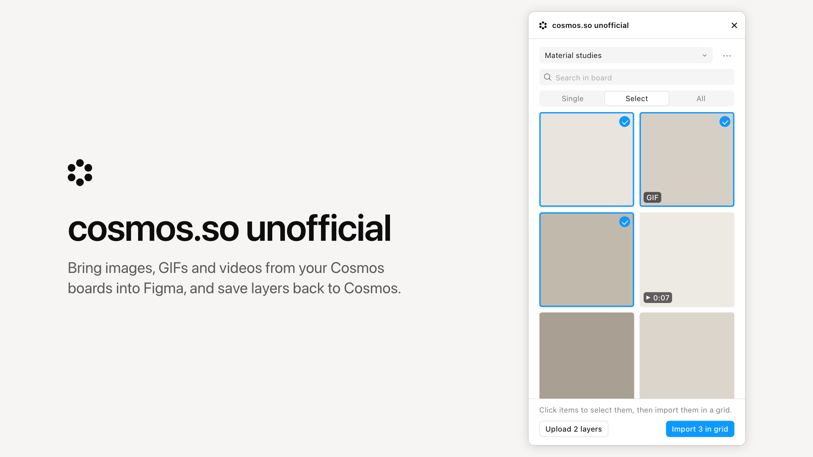

# cosmos.so unofficial

A Figma and FigJam plugin for [Cosmos](https://www.cosmos.so). Bring images, GIFs and videos from your Cosmos boards into Figma, one at a time, as a selection or as whole boards, and save layers back to Cosmos.

<picture>
  <source media="(prefers-color-scheme: dark)" srcset="docs/mockup-dark.png">
  
</picture>

cosmos.so unofficial is an independent plugin, not affiliated with or endorsed by Cosmos. The Cosmos name and logo belong to Cosmos and are used here only to describe what the plugin connects to. It is not on the Figma Community and will only be published there with Cosmos's permission.

## What it does

- Lists your boards, private ones included, with their subcollections, and searches inside them by meaning, the way cosmos.so does.
- Imports in three modes. Single places one item by click or drag. Select imports the items you pick. All imports a whole board with its subcollections, or every search result.
- Import in grid puts items into sections named after the board, one per subcollection. Items keep their original ratio or get a square crop that keeps the whole file.
- GIFs stay animated or come in as stills. Videos arrive as video fills, or as their first frame where Figma allows no video.
- Images arrive as the original files at full resolution.
- Upload selection saves the selected layers to the picked board as 2x PNGs.
- Follows Figma's light and dark theme, in Figma and FigJam.

## Try it

1. Clone or download this repository.
2. In the Figma desktop app, choose Plugins, Development, Import plugin from manifest, and pick `manifest.json`.
3. Run the plugin from Plugins, Development, and sign in with your Cosmos email or username and password.

## How it works

There is no build step and no server. Figma loads the files as they are.

| File | Job |
| --- | --- |
| `manifest.json` | Plugin definition and the three allowed domains |
| `code.js` | Runs on the canvas. Places images, GIFs and videos, lays out grid imports, exports the selection and keeps the session and settings in Figma's plugin storage |
| `ui.html` | The interface and the Cosmos client, with every API call in one `<script id="cosmos">` block |
| `check.mjs` | Tests for the client and the layout, run with `node check.mjs` |
| `docs/` | The mockups and their source, the icon and a draft Community listing |

The plugin uses the GraphQL API behind cosmos.so, the same one the web app and the Save to Cosmos extension use.

| Operation | Purpose |
| --- | --- |
| `auth.login`, `auth.refreshAccessToken`, `auth.logout`, `me` | Sign-in and session |
| `clusters`, `clusterConnections` | Boards, sections and their images |
| `searchElements` | Search inside a board |
| `s3PostPolicyForImageUpload`, `element.createFromImage` | Upload |

## Privacy

- The password goes only to Cosmos's sign-in endpoint over HTTPS and is never stored.
- Cosmos's tokens stay in Figma's plugin storage on your device. Sign out deletes them and ends the session.
- Every request carries `x-client-name: figma-plugin-unofficial`, so Cosmos can tell this traffic apart.
- Network access is limited to `api.www.cosmos.so`, `cdn.cosmos.so` and `s3.amazonaws.com`.

## Limits

- Search returns up to 500 results, ranked by relevance.
- Images above Figma's 4096 px limit, and formats Figma cannot read, come in as resized PNGs.
- Video fills need a paid Figma Design file. In FigJam and on free plans, videos come in as their first frame.

## For the Cosmos team

I built this for my own work and would like to share it with other Cosmos users on the Figma Community, with your permission. I am happy to move it to an official API or OAuth, rename it, change the branding, or hand it over to you. Open an issue here or reach me on [GitHub](https://github.com/marco-vrinssen).

## License

MIT for the code. The Cosmos name and logo belong to Cosmos.
